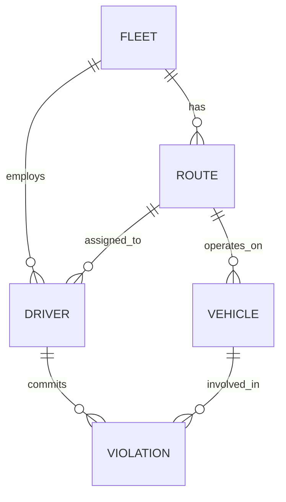

# 公交安全管理系统数据库设计报告

## 1. 需求分析

### 1.1 系统概述
本系统旨在为公交公司提供一个安全管理平台，主要用于管理公交车队、司机、车辆以及违章记录等信息，实现对公交运营安全的有效监管。

### 1.2 数据需求
系统需要管理以下主要数据：
- 车队信息：车队编号、车队名称等
- 线路信息：线路编号、线路名称、所属车队等
- 司机信息：工号、姓名、性别、所属车队、所属线路、是否为队长/路队长等
- 车辆信息：车牌号、座位数、所属线路等
- 违章记录：违章类型、时间、地点、涉及司机、涉及车辆等

### 1.3 功能需求
1. 基础信息管理
   - 车队信息的添加、查看
   - 线路信息的添加、查看
   - 司机信息的添加、查看
   - 车辆信息的添加、查看

2. 违章管理
   - 违章记录的录入（仅队长和路队长可操作）
   - 违章记录的查看

3. 查询统计
   - 车队司机查询
   - 司机违章查询
   - 车队违章统计

## 2. 概念结构设计

### 2.1 实体定义
1. 车队（FLEET）
   - 属性：车队编号、车队名称

2. 线路（ROUTE）
   - 属性：线路编号、线路名称

3. 司机（DRIVER）
   - 属性：工号、姓名、性别、是否为队长、是否为路队长

4. 车辆（VEHICLE）
   - 属性：车牌号、座位数

5. 违章记录（VIOLATION）
   - 属性：违章类型、时间、地点

### 2.2 E-R图


## 3. 逻辑结构设计

### 3.1 关系模式
将E-R图转换为以下关系模式：

1. 车队(id, name, created_at)
   - 主码：id

2. 线路(id, name, fleet_id, created_at)
   - 主码：id
   - 外码：fleet_id 参照 车队(id)

3. 司机(id, job_number, name, gender, fleet_id, route_id, is_captain, is_route_captain, created_at)
   - 主码：id
   - 外码：fleet_id 参照 车队(id)
   - 外码：route_id 参照 线路(id)

4. 车辆(id, plate_number, seats, route_id, created_at)
   - 主码：id
   - 外码：route_id 参照 线路(id)

5. 违章(id, driver_id, vehicle_id, violation_type, time, location, created_at)
   - 主码：id
   - 外码：driver_id 参照 司机(id)
   - 外码：vehicle_id 参照 车辆(id)

### 3.2 视图设计
为提高查询效率，设计了以下视图：

1. driver_fleet_view：用于车队司机查询
2. driver_violation_view：用于司机违章查询
3. fleet_violation_stats_view：用于车队违章统计
4. violation_list_view：用于违章记录列表显示

## 4. 程序开发环境及应用环境

### 4.1 开发环境
- 操作系统：Linux
- 数据库：MySQL 8.0.3
- 开发语言：Python 3.8
- Web框架：Flask
- 前端技术：HTML、CSS

### 4.2 主要工具
- 代码编辑器：VS Code
- 版本控制：Git

## 5. 应用程序设计中遇到的问题及解决方法

### 5.1 数据关联问题
**问题**：在设计违章记录时，需要同时关联司机和车辆信息，且要考虑所属车队和线路。
**解决方法**：创建视图整合多表信息，简化查询操作。

### 5.2 权限控制问题
**问题**：只有队长和路队长可以录入违章信息。
**解决方法**：在司机表中添加is_captain和is_route_captain字段，进行权限判断。

### 5.3 时间处理问题
**问题**：前端日期时间输入与数据库存储格式不一致。
**解决方法**：使用datetime模块进行格式转换，统一使用日期格式。

## 6. 总结

本系统成功实现了公交安全管理的基本功能，包括基础信息管理、违章记录管理和统计查询等功能。通过合理的数据库设计和视图的使用，提高了系统的性能和可维护性。

在开发过程中，注重了以下几个方面：
1. 数据完整性：通过主外键约束确保数据的关联性
2. 查询效率：通过视图优化复杂查询
3. 用户体验：设计直观的操作界面
4. 代码复用：采用模块化设计

## 7. 附录：主要代码

完整仓库代码见[https://github.com/GodHu777777/BusManageSystem](https://github.com/GodHu777777/BusManageSystem)

### 7.1 数据库初始化代码
```python
# init_db.py 代码
import mysql.connector
from app import db_config

def init_database():
    conn = mysql.connector.connect(
        host=db_config['host'],
        user=db_config['user'],
        password=db_config['password']
    )
    cursor = conn.cursor()

    # 删除已存在的数据库并重新创建
    cursor.execute("DROP DATABASE IF EXISTS flaskdb")
    cursor.execute("CREATE DATABASE flaskdb")
    cursor.execute("USE flaskdb")

    # 创建表
    create_tables = [
        """
        CREATE TABLE IF NOT EXISTS fleets (
            id INT PRIMARY KEY AUTO_INCREMENT,
            name VARCHAR(100) NOT NULL UNIQUE,
            created_at TIMESTAMP DEFAULT CURRENT_TIMESTAMP
        )
        """,
        """
        CREATE TABLE IF NOT EXISTS routes (
            id INT PRIMARY KEY AUTO_INCREMENT,
            name VARCHAR(100) NOT NULL,
            fleet_id INT NOT NULL,
            created_at TIMESTAMP DEFAULT CURRENT_TIMESTAMP,
            FOREIGN KEY (fleet_id) REFERENCES fleets(id)
        )
        """,
        """
        CREATE TABLE IF NOT EXISTS drivers (
            id INT PRIMARY KEY AUTO_INCREMENT,
            job_number VARCHAR(20) NOT NULL UNIQUE,
            name VARCHAR(100) NOT NULL,
            gender ENUM('male', 'female') NOT NULL,
            fleet_id INT NOT NULL,
            route_id INT,
            is_captain BOOLEAN DEFAULT FALSE,
            is_route_captain BOOLEAN DEFAULT FALSE,
            created_at TIMESTAMP DEFAULT CURRENT_TIMESTAMP,
            FOREIGN KEY (fleet_id) REFERENCES fleets(id),
            FOREIGN KEY (route_id) REFERENCES routes(id)
        )
        """,
        """
        CREATE TABLE IF NOT EXISTS vehicles (
            id INT PRIMARY KEY AUTO_INCREMENT,
            plate_number VARCHAR(20) NOT NULL UNIQUE,
            seats INT NOT NULL,
            route_id INT,
            created_at TIMESTAMP DEFAULT CURRENT_TIMESTAMP,
            FOREIGN KEY (route_id) REFERENCES routes(id)
        )
        """,
        """
        CREATE TABLE IF NOT EXISTS violations (
            id INT PRIMARY KEY AUTO_INCREMENT,
            driver_id INT NOT NULL,
            vehicle_id INT NOT NULL,
            violation_type ENUM('red_light', 'zebra_crossing', 'cross_line', 'illegal_parking') NOT NULL,
            time DATETIME NOT NULL,
            location VARCHAR(200),
            created_at TIMESTAMP DEFAULT CURRENT_TIMESTAMP,
            FOREIGN KEY (driver_id) REFERENCES drivers(id),
            FOREIGN KEY (vehicle_id) REFERENCES vehicles(id)
        )
        """
    ]

    # 执行建表语句
    for table in create_tables:
        cursor.execute(table)

    # 创建视图
    create_views = [
        """
        CREATE OR REPLACE VIEW driver_fleet_view AS
        SELECT 
            d.id as driver_id,
            d.job_number,
            d.name as driver_name,
            d.gender,
            d.fleet_id,
            f.name as fleet_name,
            r.id as route_id,
            r.name as route_name
        FROM drivers d
        JOIN fleets f ON d.fleet_id = f.id
        LEFT JOIN routes r ON d.route_id = r.id
        """,
        """
        CREATE OR REPLACE VIEW driver_violation_view AS
        SELECT 
            v.id as violation_id,
            v.violation_type,
            v.time,
            v.location,
            d.id as driver_id,
            d.name as driver_name,
            d.job_number,
            vh.plate_number,
            r.name as route_name,
            f.name as fleet_name
        FROM violations v
        JOIN drivers d ON v.driver_id = d.id
        JOIN vehicles vh ON v.vehicle_id = vh.id
        JOIN routes r ON d.route_id = r.id
        JOIN fleets f ON d.fleet_id = f.id
        """,
        """
        CREATE OR REPLACE VIEW fleet_violation_stats_view AS
        SELECT 
            f.id as fleet_id,
            f.name as fleet_name,
            v.violation_type,
            COUNT(*) as violation_count,
            DATE(v.time) as violation_date
        FROM violations v
        JOIN drivers d ON v.driver_id = d.id
        JOIN fleets f ON d.fleet_id = f.id
        GROUP BY f.id, f.name, v.violation_type, DATE(v.time)
        """,
        """
        CREATE OR REPLACE VIEW violation_list_view AS
        SELECT 
            v.id,
            d.name as driver_name,
            d.job_number,
            vh.plate_number,
            r.name as route_name,
            f.name as fleet_name,
            v.violation_type,
            v.time,
            v.location
        FROM violations v
        JOIN drivers d ON v.driver_id = d.id
        JOIN vehicles vh ON v.vehicle_id = vh.id
        JOIN routes r ON d.route_id = r.id
        JOIN fleets f ON d.fleet_id = f.id
        """
    ]

    # 执行创建视图的语句
    for view in create_views:
        try:
            cursor.execute(view)
        except mysql.connector.Error as err:
            print(f"Error creating view: {err}")

    # 插入测试数据
    test_data = [
        """
        INSERT INTO fleets (name) VALUES 
        ('fleet_one'),
        ('fleet_two')
        """,
        """
        INSERT INTO routes (name, fleet_id) VALUES 
        ('route_1', 1),
        ('route_2', 1),
        ('route_3', 2)
        """,
        """
        INSERT INTO drivers (job_number, name, gender, fleet_id, route_id, is_captain, is_route_captain) VALUES 
        ('d001', 'john', 'male', 1, 1, false, true),
        ('d002', 'mike', 'male', 1, 1, false, false),
        ('d003', 'sarah', 'female', 2, 2, true, false)
        """,
        """
        INSERT INTO vehicles (plate_number, seats, route_id) VALUES 
        ('bj12345', 35, 1),
        ('bj23456', 35, 2),
        ('bj34567', 35, 3)
        """,
        """
        INSERT INTO violations (driver_id, vehicle_id, violation_type, time, location) VALUES 
        (1, 1, 'red_light', '2024-01-01 08:30:00', 'location_1'),
        (2, 2, 'zebra_crossing', '2024-01-02 09:15:00', 'location_2'),
        (1, 1, 'illegal_parking', '2024-01-03 14:20:00', 'location_3')
        """
    ]

    # 执行插入测试数据的语句
    for data in test_data:
        try:
            cursor.execute(data)
        except mysql.connector.Error as err:
            print(f"Error inserting test data: {err}")

    # 提交更改
    conn.commit()
    cursor.close()
    conn.close()

if __name__ == "__main__":
    init_database() 
```

### 7.2 应用程序主要代码
```python
# app.py 代码
from flask import Flask, render_template, request, redirect, url_for
import mysql.connector
from datetime import datetime, date

app = Flask(__name__)

# 保持原有的 MySQL 配置
db_config = {
    'host': '127.0.0.1',
    'user': 'root',
    'password': '123456',
    'database': 'flaskdb'
}

def get_db_connection():
    conn = mysql.connector.connect(**db_config)
    return conn

# 首页 - 显示主要功能入口
@app.route('/')
def index():
    return render_template('index.html')

# 1. 司机管理
@app.route('/drivers')
def list_drivers():
    conn = get_db_connection()
    cursor = conn.cursor(dictionary=True)
    cursor.execute('''
        SELECT d.*, f.name as fleet_name, r.name as route_name 
        FROM drivers d 
        JOIN fleets f ON d.fleet_id = f.id 
        LEFT JOIN routes r ON d.route_id = r.id
    ''')
    drivers = cursor.fetchall()
    cursor.close()
    conn.close()
    return render_template('drivers/list.html', drivers=drivers)

@app.route('/driver/add', methods=['GET', 'POST'])
def add_driver():
    if request.method == 'POST':
        conn = get_db_connection()
        cursor = conn.cursor()
        cursor.execute(
            'INSERT INTO drivers (job_number, name, gender, fleet_id, route_id) VALUES (%s, %s, %s, %s, %s)',
            (
                request.form['job_number'],
                request.form['name'],
                request.form['gender'],
                request.form['fleet_id'],
                request.form['route_id'] or None
            )
        )
        conn.commit()
        cursor.close()
        conn.close()
        return redirect(url_for('list_drivers'))
    
    # 获取车队和线路列表
    conn = get_db_connection()
    cursor = conn.cursor(dictionary=True)
    cursor.execute('SELECT id, name FROM fleets')
    fleets = cursor.fetchall()
    cursor.execute('SELECT id, name FROM routes')
    routes = cursor.fetchall()
    cursor.close()
    conn.close()
    return render_template('drivers/add.html', fleets=fleets, routes=routes)

# 2. 车辆管理
@app.route('/vehicles')
def list_vehicles():
    conn = get_db_connection()
    cursor = conn.cursor(dictionary=True)
    cursor.execute('SELECT plate_number, seats FROM vehicles')
    vehicles = cursor.fetchall()
    cursor.close()
    conn.close()
    return render_template('vehicles/list.html', vehicles=vehicles)

@app.route('/vehicle/add', methods=['GET', 'POST'])
def add_vehicle():
    if request.method == 'POST':
        conn = get_db_connection()
        cursor = conn.cursor()
        cursor.execute(
            'INSERT INTO vehicles (plate_number, seats) VALUES (%s, %s)',
            (
                request.form['plate_number'],
                request.form['seats']
            )
        )
        conn.commit()
        cursor.close()
        conn.close()
        return redirect(url_for('list_vehicles'))
    
    return render_template('vehicles/add.html')

# 3. 违章管理
@app.route('/violations')
def list_violations():
    conn = get_db_connection()
    cursor = conn.cursor(dictionary=True)
    cursor.execute('''
        SELECT 
            v.id,
            d.name as driver_name,
            d.job_number,
            vh.plate_number,
            r.name as route_name,
            f.name as fleet_name,
            v.violation_type,
            v.time,
            v.location
        FROM violations v
        JOIN drivers d ON v.driver_id = d.id
        JOIN vehicles vh ON v.vehicle_id = vh.id
        JOIN routes r ON d.route_id = r.id
        JOIN fleets f ON d.fleet_id = f.id
        ORDER BY v.time DESC
    ''')
    violations = cursor.fetchall()
    cursor.close()
    conn.close()
    return render_template('violations/list.html', violations=violations)

@app.route('/violation/add', methods=['GET', 'POST'])
def add_violation():
    # 检查当前用户是否为队长或路队长
    is_captain = True  # 这里应该从用户会话中获取实际的权限状态
    
    if request.method == 'POST' and is_captain:
        # 将前端传来的date格式转换为MySQL datetime格式
        violation_date = datetime.strptime(request.form['time'], '%Y-%m-%d')
        
        conn = get_db_connection()
        cursor = conn.cursor()
        cursor.execute(
            'INSERT INTO violations (driver_id, vehicle_id, violation_type, time, location) VALUES (%s, %s, %s, %s, %s)',
            (
                request.form['driver_id'],
                request.form['vehicle_id'],
                request.form['violation_type'],
                violation_date,
                request.form['location']
            )
        )
        conn.commit()
        cursor.close()
        conn.close()
        return redirect(url_for('list_violations'))
    
    # 获取可选的司机和车辆列表
    conn = get_db_connection()
    cursor = conn.cursor(dictionary=True)
    
    # 获取当前用户管理的车队/线路的司机
    cursor.execute('''
        SELECT d.id, d.name, d.job_number 
        FROM drivers d
    ''')
    drivers = cursor.fetchall()
    
    # 获取车辆列表
    cursor.execute('SELECT id, plate_number FROM vehicles')
    vehicles = cursor.fetchall()
    
    cursor.close()
    conn.close()
    
    # 设置默认的违章日期为当前日期
    default_time = date.today().strftime('%Y-%m-%d')
    
    return render_template('violations/add.html', 
                         drivers=drivers,
                         vehicles=vehicles,
                         is_captain=is_captain,
                         default_time=default_time)

# 4. 查询功能
@app.route('/fleet/drivers', methods=['GET'])
def fleet_drivers():
    # 如果没有传入fleet_id参数，显示选择车队的表单
    if not request.args.get('fleet_id'):
        conn = get_db_connection()
        cursor = conn.cursor(dictionary=True)
        cursor.execute('SELECT id, name FROM fleets')
        fleets = cursor.fetchall()
        cursor.close()
        conn.close()
        return render_template('queries/fleet_drivers_form.html', fleets=fleets)
    
    # 如果传入了fleet_id，显示查询结果
    fleet_id = request.args.get('fleet_id')
    conn = get_db_connection()
    cursor = conn.cursor(dictionary=True)
    cursor.execute('''
        SELECT driver_id, job_number, driver_name, gender, route_name
        FROM driver_fleet_view
        WHERE fleet_id = %s
    ''', (fleet_id,))
    drivers = cursor.fetchall()
    cursor.close()
    conn.close()
    return render_template('queries/fleet_drivers.html', drivers=drivers)

@app.route('/driver/violations', methods=['GET'])
def driver_violations():
    driver_id = request.args.get('driver_id')
    start_date = request.args.get('start_date')
    end_date = request.args.get('end_date')
    
    if driver_id and start_date and end_date:
        conn = get_db_connection()
        cursor = conn.cursor(dictionary=True)
        cursor.execute('''
            SELECT violation_type, time, location, plate_number
            FROM driver_violation_view
            WHERE driver_id = %s AND DATE(time) BETWEEN %s AND %s
        ''', (driver_id, start_date, end_date))
        violations = cursor.fetchall()
        cursor.close()
        conn.close()
        return render_template('queries/driver_violations.html', violations=violations)
    
    # 获取司机列表供选择
    conn = get_db_connection()
    cursor = conn.cursor(dictionary=True)
    cursor.execute('SELECT id, name, job_number FROM drivers')
    drivers = cursor.fetchall()
    cursor.close()
    conn.close()
    return render_template('queries/driver_violations_form.html', drivers=drivers)

@app.route('/fleet/violation_stats', methods=['GET'])
def fleet_violation_stats():
    fleet_id = request.args.get('fleet_id')
    start_date = request.args.get('start_date')
    end_date = request.args.get('end_date')
    
    if fleet_id and start_date and end_date:
        conn = get_db_connection()
        cursor = conn.cursor(dictionary=True)
        cursor.execute('''
            SELECT violation_type, SUM(violation_count) as total_count
            FROM fleet_violation_stats_view
            WHERE fleet_id = %s AND violation_date BETWEEN %s AND %s
            GROUP BY violation_type
        ''', (fleet_id, start_date, end_date))
        stats = cursor.fetchall()
        cursor.close()
        conn.close()
        return render_template('queries/violation_stats.html', stats=stats)
    
    # 获取车队列表供选择
    conn = get_db_connection()
    cursor = conn.cursor(dictionary=True)
    cursor.execute('SELECT id, name FROM fleets')
    fleets = cursor.fetchall()
    cursor.close()
    conn.close()
    return render_template('queries/violation_stats_form.html', fleets=fleets)

if __name__ == '__main__':
    app.run(host='0.0.0.0', port=5000, debug=True)

```
